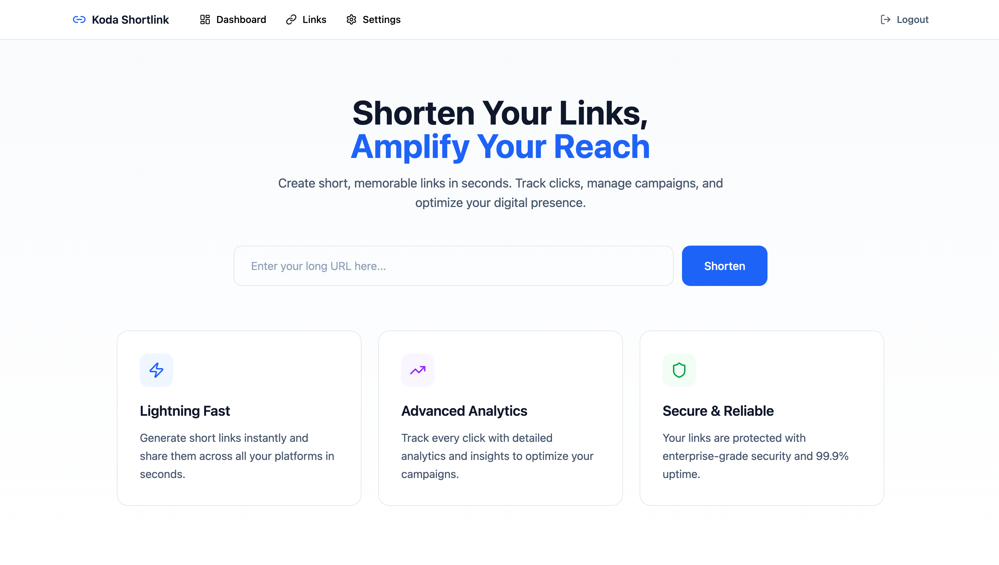
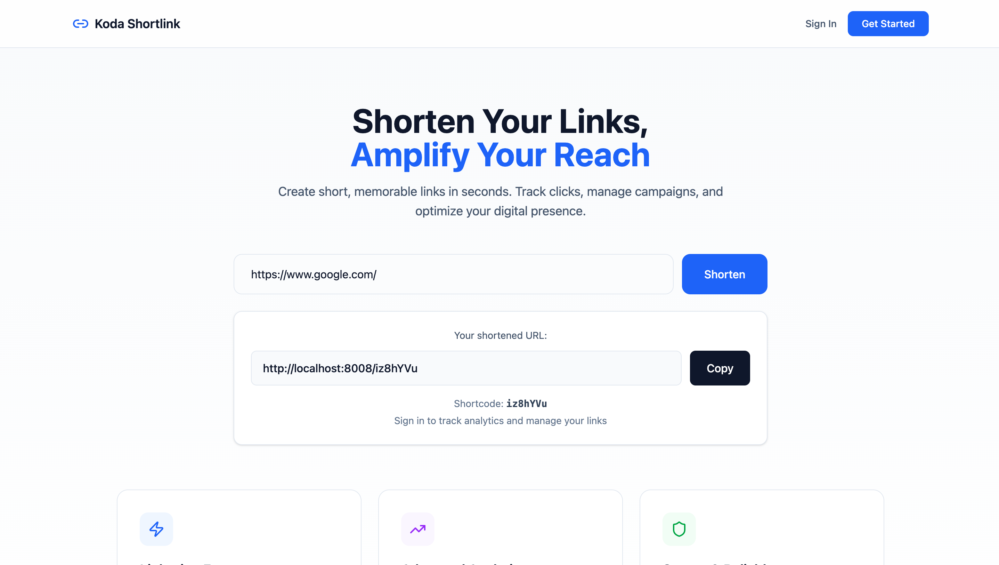
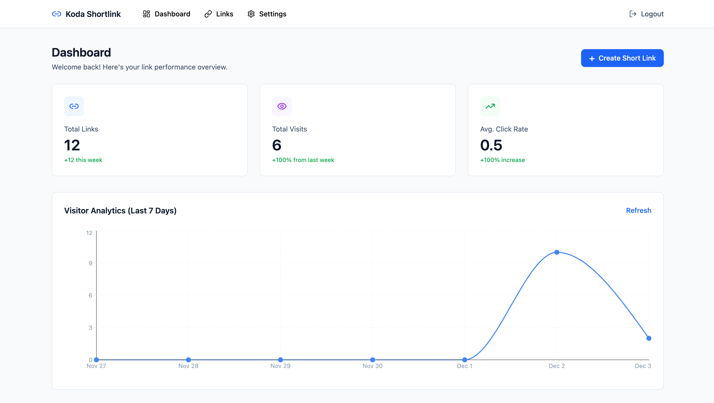
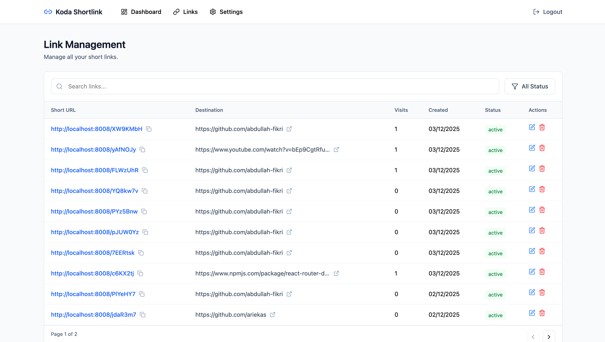

# 🎨 KODA SHORTLINK (React + Vite + Tailwind)
📌 sebuah aplikasi front end yang digunakan untuk generate short url 

## Frontend dari aplikasi URL Shortener.
### Fitur utama:

- Login & register

- Dashboard list short link

- Management link created

- Create new short link

- Analytics view

- Responsive UI

### 🚀 How to Run 

#### Install dependencies:

- npm install

Jalankan :

- npm run dev

### Tech Stack

- React

- Vite

- TailwindCSS

- React Router DOM

- Context API for Auth